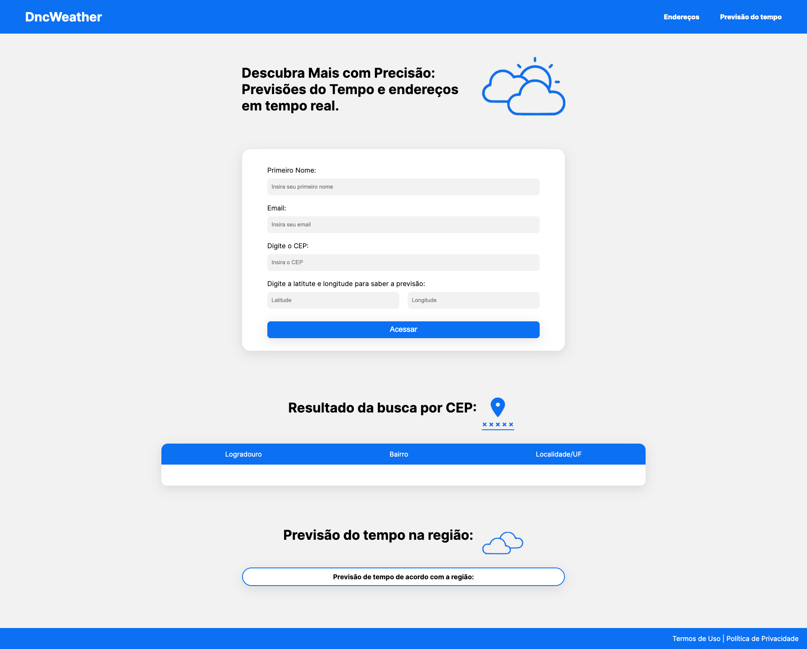

# DNC 🇧🇷 Zipcode and 🌡️ Weather Search 👨🏻‍💻

## 🔥 Context:

You've just been recruited as the newest developer at a startup
innovative called "DncWeather". This startup is revolutionizing the way
how companies manage internal and external information.

Your first mission at "DncWeather" is to develop an internal system for employees,
that will help them access critical information about addresses and forecasts
weather conditions efficiently.

"DncWeather" believes that accessibility and simplicity are fundamental
for the success of any internal system. Therefore, your initial task is to create
an attractive and functional user interface that will allow employees
Easily enter the information required to obtain address and
weather forecasts. This will be the first step in building the system
that will transform the experience of employees in the company.

[Figma UI provided by them](https://www.figma.com/file/cPLXzs1LNGDRDluE5pr1z4/Desafio-02%3A-Desafio%3A-Desenvolva-tela-funcional-com-consumo-de-API%C2%B4s?type=design&node-id=0%3A1&mode=design&t=d8zmI3ZfcJ7SzKfW-1)

## 🧠 What I've learned working on this project:

- ✅ How to consume the [ViaCep API](https://viacep.com.br/)
- ✅ How to consume the [Open-Meto API](https://open-meteo.com/)
- ✅ How to validate inputs before submit them
- ✅ Create a Zipcode mask from zero (without lib)
- ✅ Work with Event listener and Keypress
- ✅ Work with querySelectors

Hope you enjoy as much as I have! ⭐

### Screenshot:

 
